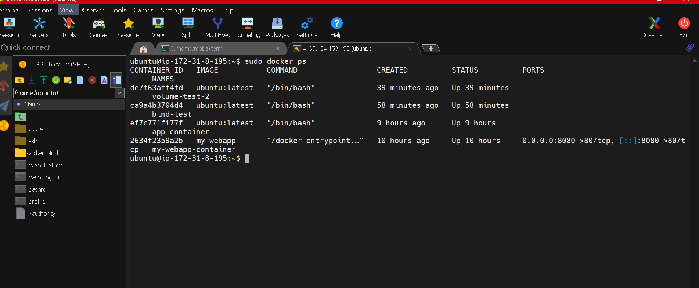
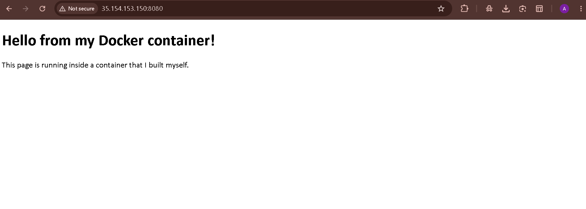
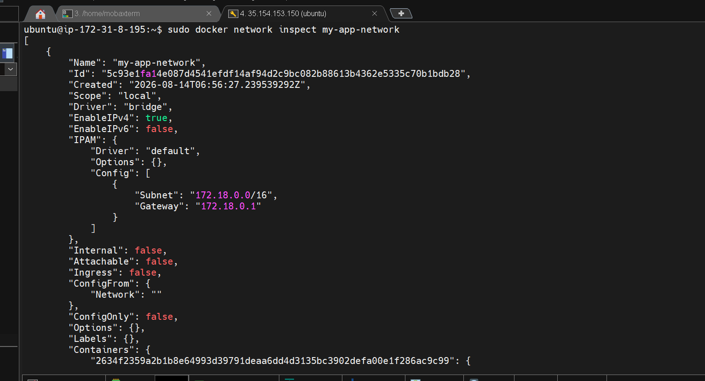
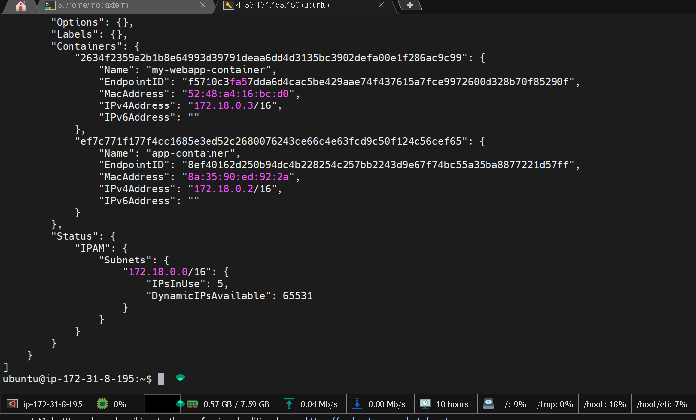
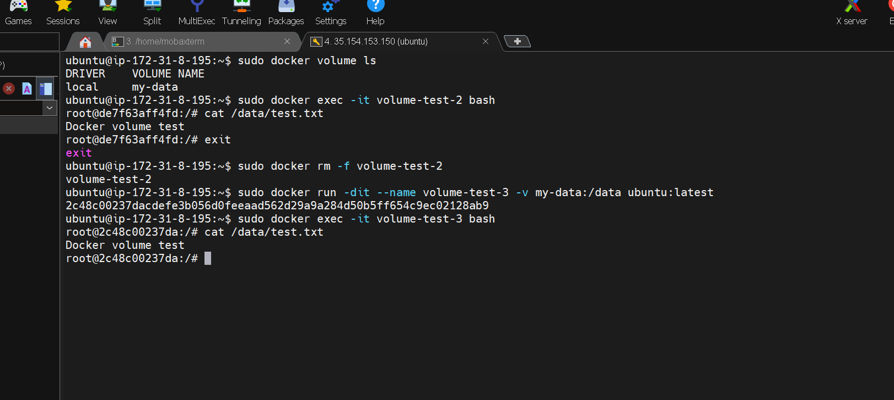

# 🐳 Docker Containerization Lab

<p align="center">
  
</p>

<p align="center">
  
  
  
  
</p>

> A hands-on Docker learning project covering container fundamentals, port mapping, networking, persistent storage, bind mounts, and container-to-container communication — built and tested on Ubuntu running on AWS EC2.

---

## 🚀 What This Project Demonstrates

This isn't just a collection of Docker commands.

Each lab was **implemented, tested, troubleshot, and documented** in a real Linux cloud environment.

```text
                    AWS EC2
                       │
                       ▼
                ┌─────────────┐
                │    Docker   │
                └──────┬──────┘
                       │
          ┌────────────┼────────────┐
          ▼            ▼            ▼
     Containers    Networking    Storage
          │            │            │
          ▼            ▼            ▼
      Port 8080    Bridge DNS    Volumes
          │        Container     Bind Mounts
          ▼       Connectivity       │
      Nginx Web        │              ▼
        App            └──────► Persistent Data
```

---

## 🎯 Learning Objectives

* Understand Docker container lifecycle
* Run and manage containers
* Publish container ports
* Build custom Docker networks
* Enable container-to-container communication
* Understand Docker's internal DNS
* Implement persistent storage with Docker volumes
* Implement bind mounts
* Understand container vs persistent storage
* Troubleshoot common Docker issues

---

## 🧰 Lab Environment

| Component             | Configuration              |
| --------------------- | -------------------------- |
| ☁️ Cloud              | AWS EC2                    |
| 🐧 OS                 | Ubuntu Linux               |
| 🐳 Container Platform | Docker                     |
| 🌐 Network            | Docker Bridge              |
| 🖥️ Web Server        | Nginx                      |
| 🔐 Access             | SSH                        |
| 💾 Storage            | Docker Volume + Bind Mount |

---

# 📚 Labs

## 01 — Docker Container Basics

**Status: ✅ Completed**

Learned:

* Creating Docker containers
* Starting and stopping containers
* Listing running containers
* Executing commands inside containers
* Understanding container lifecycle
* Working with container names and IDs

📂 **[Open Lab →](./01-container-basics/)**

### 📸 Evidence

The Docker container was successfully created and verified using `docker ps`.




---

## 02 — Port Mapping

**Status: ✅ Completed**

Implemented:

```text
Host Port 8080
      │
      ▼
Container Port 80
      │
      ▼
   Nginx Web App
```

Learned:

* Publishing container ports
* Host-to-container port mapping
* Accessing a containerized web application
* Testing connectivity using `curl`
* Browser-based application access

📂 **[Open Lab →](./02-port-mapping/)**

### 🌐 Web Application



---

## 03 — Docker Networking

**Status: ✅ Completed**

Created a custom Docker bridge network:

```text
my-app-network
```

The network allowed:

```text
app-container
      │
      │ Docker DNS / HTTP
      ▼
my-webapp-container
```

Learned:

* Custom bridge networks
* Container network attachment
* Docker internal DNS
* Container-to-container communication
* Network inspection

📂 **[Open Lab →](./03-docker-networking/)**

### Network Evidence





### Container Connectivity



---

## 04 — Docker Volumes

**Status: ✅ Completed**

Implemented a named Docker volume:

```text
my-data
```

The lab demonstrated that data remains available even after the original container is removed.

```text
Container 1
     │
     ▼
 my-data volume
     │
     ▼
Container removed
     │
     ▼
Container 2
     │
     ▼
Same data available
```

📂 **[Open Lab →](./04-docker-volumes/)**

### Persistence Evidence


---

## 05 — Docker Bind Mounts

**Status: ✅ Completed**

Implemented host-to-container file sharing:

```text
Ubuntu Host
~/docker-bind
      ↕
   Bind Mount
      ↕
Container
/data
```

Learned:

* Host directory mounting
* Container-to-host file sharing
* Host-to-container file sharing
* Difference between volumes and bind mounts

📂 **[Open Lab →](./05-bind-mounts/)**

### Bind Mount Evidence


---

# 📸 Practical Evidence

The project contains real screenshots captured during the hands-on labs.

| Evidence                  | Demonstrates                          |
| ------------------------- | ------------------------------------- |
| 🖥️ Container + Port      | Container lifecycle & port publishing |
| 🌐 Web Application        | External application access           |
| 🔗 Network Inspection     | Custom Docker bridge network          |
| 🔄 Container Connectivity | Container-to-container communication  |
| 💾 Volume Persistence     | Persistent data                       |
| 📁 Bind Mount             | Host ↔ container file sharing         |

📂 **[View All Screenshots →](./screenshots/)**

---

# 🧪 Commands Practiced

### Containers

```bash
docker ps
docker ps -a
docker run
docker exec
docker stop
docker rm
```

### Networking

```bash
docker network ls
docker network create my-app-network
docker network inspect my-app-network
```

### Volumes

```bash
docker volume create my-data
docker volume ls
docker volume inspect my-data
```

### Storage

```bash
docker run -v my-data:/data ubuntu
docker run -v ~/docker-bind:/data ubuntu
```

---

# 🧠 Key Learnings

### Containerization

Understanding how applications can be packaged and isolated using containers.

### Networking

Understanding Docker bridge networks, internal DNS, container IPs, and service-to-service communication.

### Persistent Storage

Understanding why application data should not rely only on a container's writable layer.

### Volumes vs Bind Mounts

Understanding when Docker-managed volumes and host-managed bind mounts are appropriate.

### Troubleshooting

Worked through practical issues including:

* Docker socket permission errors
* Container naming conflicts
* Container shell access
* Network inspection
* Persistent data verification
* Host-to-container file sharing

---

# 📊 Learning Progress

```text
Docker Fundamentals       ████████████████████ 100%
Port Mapping              ████████████████████ 100%
Networking                ████████████████████ 100%
Container Connectivity    ████████████████████ 100%
Docker Volumes            ████████████████████ 100%
Bind Mounts               ████████████████████ 100%

Dockerfile                ░░░░░░░░░░░░░░░░░░░░  Next
Docker Compose             ░░░░░░░░░░░░░░░░░░░░  Planned
Multi-Container App        ░░░░░░░░░░░░░░░░░░░░  Planned
Docker + AWS Deployment    ░░░░░░░░░░░░░░░░░░░░  Planned
```

---

# 🗺️ Roadmap

### Completed

* [x] Docker Container Basics
* [x] Port Mapping
* [x] Docker Networking
* [x] Container-to-Container Communication
* [x] Docker Volumes
* [x] Bind Mounts

### Coming Next

* [ ] Dockerfile & Custom Images
* [ ] Docker Image Optimization
* [ ] Docker Compose
* [ ] Environment Variables
* [ ] Docker Health Checks
* [ ] Container Logging
* [ ] Docker Security Basics
* [ ] Multi-Container Application
* [ ] Docker + AWS Deployment
* [ ] Amazon ECR
* [ ] Amazon ECS

---

# 📂 Repository Structure

```text
docker-containerization-lab/
│
├── 01-container-basics/
│   └── README.md
│
├── 02-port-mapping/
│   └── README.md
│
├── 03-docker-networking/
│   └── README.md
│
├── 04-docker-volumes/
│   └── README.md
│
├── 05-bind-mounts/
│   └── README.md
│
├── screenshots/
│   ├── docker-container-port-mapping.png
│   ├── docker-webapp-browser.png
│   ├── docker-network-inspection-part1.png
│   ├── docker-network-inspection-part2.png
│   ├── docker-container-connectivity.png
│   ├── docker-volume-persistence.png
│   └── docker-bind-mount.png
│
├── README.md
└── LICENSE
```

---

# 👨‍💻 About Me

I'm **Abhishek Pandey**, a Cloud Pre-Sales Engineer focused on AWS architecture, cost optimization, and Well-Architected best practices.

This Docker project is part of my hands-on learning journey to strengthen practical containerization and infrastructure skills alongside my AWS architecture work.

### 🔗 Connect with me
[](mailto:abhishek071700@gmail.com)
[](https://linkedin.com/in/abhishek-pandey-045241316)
[](https://github.com/abhishek071700)
---

# ⭐ If You Found This Useful

If this project helped you understand Docker concepts, feel free to **star ⭐ the repository** and follow along as the lab progresses into Dockerfiles, Compose, multi-container applications, and AWS deployment.

---

## 📄 License

This project is licensed under the **MIT License**.
